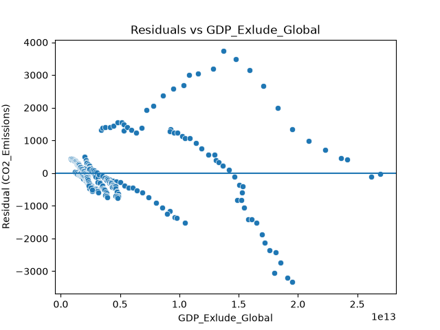

# datafun-07-regression

[](https://denisecase.github.io/pro-analytics-02/workflow-b-apply-example-project/)
[](./pyproject.toml)
[](./LICENSE)

> Professional Python project: linear regression and predictive analytics.

## Project Goal

Improve Linear Regression


## Command Reference

<details>
<summary>Show command reference</summary>

### In a machine terminal (open in your `Repos` folder)

After you get a copy of this repo in your own GitHub account,
open a machine terminal in your `Repos` folder:

```shell

git clone https://github.com/ajaneh/datafun-07-regression

cd datafun-07-regression
code .
```

### In a VS Code terminal

```shell
uv self update
uv python pin 3.14
uv lock --upgrade
uv sync --extra dev --extra docs --upgrade

uvx pre-commit install

git add -A
uvx pre-commit run --all-files
# repeat if changes were made
uvx pre-commit run --all-files

# run the penguin example: is there a linear relationship?
uv run python -m datafun.app_penguins_case

# run the co2 example: is there a linear relationship?
# the line fits poorly; why?  what would you change?
uv run python -m datafun.app_co2_case

# do chores
uv run python -m pyright
uv run python -m pytest
uv run python -m zensical build

# save progress
git add -A
git commit -m "update"
git push -u origin main
```

</details>


## Findings and Visuals

## Penguins: There's a linear Relationship


## World Data: Is there a linear relationship? How can you improve the analysis?


## The first thing we can do to improve the linear relationship is exclude global/world GDP values




## Project Documentation

[docs/index.md](docs/index.md)

## Citation

[CITATION.cff](./CITATION.cff)

## License

[MIT](./LICENSE)
