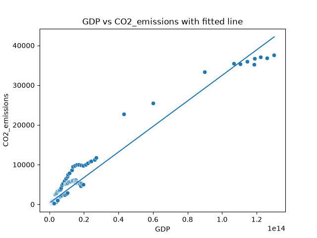
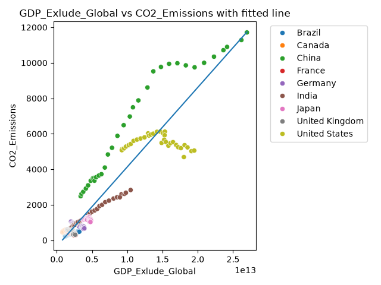

# Project Documentation

## Custom Project

### Basis

I began with the “CO₂ emissions” dataset provided by the instructor, originally published online at OurWorldinData.org.
This Dataset covers the years 1990-2024, with annual GPD and Carbon Dioxide emissions for several countries. The data included further information but this is the focus of the modified workflow.

### Phase 4 Modifications

First I began by saving the figures to file, and also saving the summary of numbers describing the quality of fit for the linear regression, such as RMSE and R^2. I swapped GDP as the feature for population, tried GDP vs CO2 per capita, but none of those results showed a linear pattern

### Phase 5 Custom Project

Describe your custom project,
what you recommend changing from the example,
what results you analyzed, and what you learned.

Include in your reflection an assessment of
how much you exercised the skills and techniques covered
and what problems you could apply them to in the future.
The original CO2 analysis compared GDP and CO2 emissions. The linear regressions is a good fit in the beginning, once GDP surpasses "0.4" the model misses. This instantly raised two questions for me. Is inflation considered in GDP? Are various currencies standardized to be comparable? When I tried to find the answers to these questions I found the explanations to be quite complicated, better suited to an economist's understanding than my own.

The initial linear regression showed that the poor fit was largely due to several outliers, I looked through the data again and noticed that World values were being included. Once those were excluded the result was a much closer fit to linear, but there still seemed to be clusters. After coloring each data point by country the economic complexities become clear. A linear regression isn't the best model when looking at several countries, the best model would likely be quadratic and need to be to be fit per each country. Interesting to explore in the future, but outside of this project's scope.

